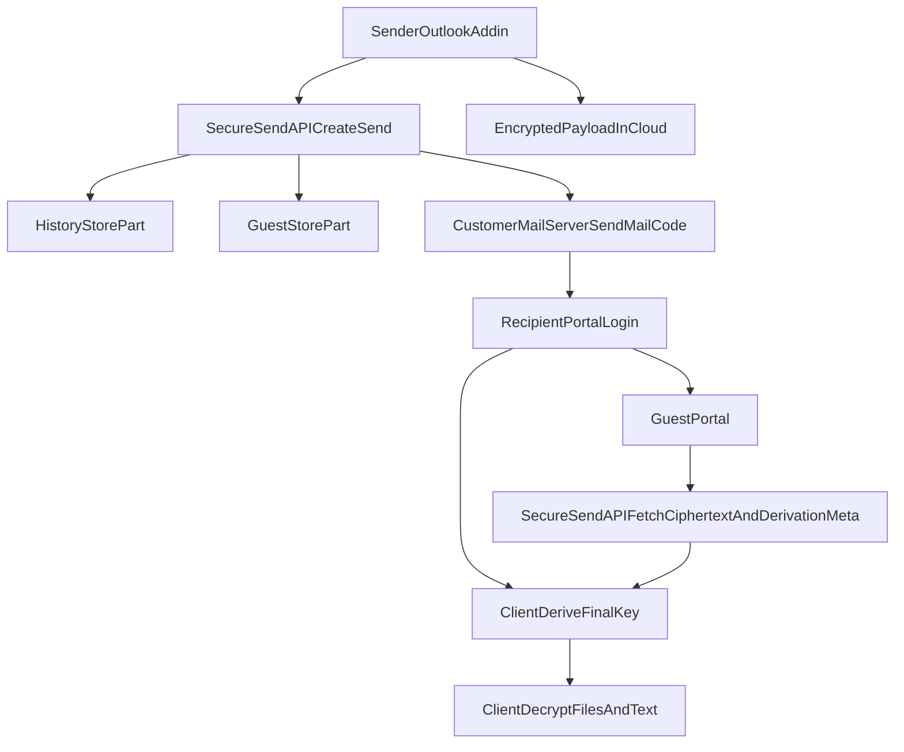

# Stufe 4 Zielarchitektur (Outlook-Add-in)

## Zweck

Dieses Dokument beschreibt die geplante technische Umsetzung von **Stufe 4** als Add-in-zentrierten Flow.
Ziel ist ein hoher Sicherheitsstandard bei gleichzeitig guter Benutzerfreundlichkeit:

- Kein manuelles langes Passwort pro Versand
- Mehrteilige Schlüsselerzeugung
- Web-App bleibt vorerst bei Stufe 1-3 produktiv

## Produktstatus

- **Heute (Web):** Stufe 4 wird sichtbar angeboten, aber serverseitig als Stufe 3 verarbeitet.
- **Zielbild (Add-in):** Stufe 4 produktiv über Outlook-Add-in, inklusive E2E für Dateien und Nachrichtentext.

---

## Sicherheitsmodell (Kurzfassung)

Für Stufe 4 wird ein finaler Entschlüsselungsschlüssel nicht als einzelner Klartext-Wert transportiert oder gespeichert.
Stattdessen wird er aus mehreren Komponenten abgeleitet.

Geplanter Ansatz:

- **Mail-Anteil** (kurzer Code, z. B. `A5B32X`) in der Versandmail
- **Versand-Anteil** im History-Datensatz
- **Empfänger-Anteil** im Gastkonto-Datensatz

Nur mit allen Teilen kann der endgültige Schlüssel abgeleitet werden.

Wichtig:
- Das ist ein starkes Mehrkomponenten-Modell.
- Striktes "Server-kann-nie-entschlüsseln" hängt davon ab, welche Teile der Server im Klartext sieht.

---

## Ziel-Flow (High Level)

---

## Kryptografisches Zielbild

## Eingänge für die Schlüsselableitung

- `mail_code` (aus Mail)
- `history_part` (serverseitig je Versand)
- `guest_part` (serverseitig je Empfänger)
- optional `device_context` (z. B. non-secret session binding)

## Ableitung

- KDF: `HKDF-SHA256` oder `PBKDF2-HMAC-SHA256`
- Output: `AES-256-GCM` Key
- Für jede Sendung eigene Nonces/IVs pro Datei/Textobjekt

## Empfehlung

- Keine selbstgebauten Krypto-Konstrukte ohne klare Trennung:
  - Geheimnisse trennen
  - klare Input-Serialisierung
  - stabile Versionierung (`kdf_version`, `cipher_version`)

---

## Datenmodell (geplant)

## `history` Erweiterungen

- `level4_key_part_history` (verschlüsselt oder KMS-protected speichern)
- `level4_mail_code_hash` (Hash statt Klartext)
- `level4_kdf_salt`
- `level4_cipher_version`
- `level4_status` (`planned`, `active`, `fallback`)

## `guests` Erweiterungen

- `level4_key_part_guest` (verschlüsselt oder KMS-protected)
- `level4_part_rotated_at`

## Optional audit/meta

- `effective_security_level`
- `requested_security_level`
- `level4_derivation_mode`

---

## API-Verträge (geplant)

## Versand (Add-in)

- Endpoint: bestehender `/send` oder add-in-spezifischer Channel (`x-securesend-client: outlook-addin`)
- Input enthält:
  - verschlüsselte Payload (Datei + ggf. Nachrichtentext)
  - `cipher_version`
  - ggf. `mail_code_hint_policy`

## Abruf für Empfänger

- Liefert nur:
  - Ciphertext-Bundle
  - derivations-relevante, nicht-sensitive Metadaten (z. B. Salt, Version)
- Kein Versand eines vollständigen finalen Entschlüsselungskeys im Klartext

---

## Mail-Design (geplant)

Mail enthält:

- sicheren Link
- kurzen Code (`Code: XXXXX`)
- Hinweistext zur Kombination mit Portal-Login

Nicht in Mail:

- vollständiger Entschlüsselungsschlüssel
- interne Schlüsselanteile

---

## Security-Entscheidungen

## Mindestanforderungen

- Klartext-Geheimnisse niemals in Audit-Logs
- Redaction in Fehlerpfaden
- Rate-Limiting für Code-Validierung
- TTL/Expiry für Mail-Codes
- Replay-Schutz (einmalig oder begrenzte Versuche)

## Offene Security-Fragen vor Go-Live

1. Welche Teile dürfen serverseitig im Klartext existieren?
2. Braucht es HSM/KMS für gespeicherte Key-Parts?
3. Soll Stufe 4 ohne Add-in strikt geblockt bleiben?
4. Wie wird `/track/e2e/{token}` an Auth-Gates gebunden?

---

## Kompatibilitätsstrategie

- Bestehende Stufen 1-3 unverändert
- Stufe 4 schrittweise aktivieren:
  1. interne Feature-Flag
  2. Pilot-Orgs
  3. breiter Rollout

## Fallback

- Wenn Add-in-Flow nicht verfügbar: automatischer Downgrade auf Stufe 3 mit transparentem Hinweis und Audit-Eintrag.

---

## Testplan für Stufe 4 (später)

## Funktional

- Add-in Versand mit Stufe 4 erfolgreich
- Empfänger kann mit Mail-Code + Portalzugang entschlüsseln
- Nachrichtentext und Dateien sind verschlüsselt abrufbar

## Negativfälle

- falscher Mail-Code
- abgelaufener Code
- fehlender Guest-Part
- manipulierte Cipher-Version

## Security

- kein Key-Leak in Logs
- kein Klartext in DB-Spalten für Payload
- kein unautorisierter Zugriff auf Ciphertext/Derivation-Meta

---

## Implementierungsphasen

1. Architektur-Freeze und Threat-Model
2. Datenmodell + Migrationen
3. Add-in-Client-Prototyp (Verschlüsseln/Ableiten/Entschlüsseln)
4. API-Endpunkte und Auth-Gates
5. E2E-Testmatrix + Security-Review
6. Pilotbetrieb

---

## Abgrenzung

Dieses Dokument ist die **Zielarchitektur** für Stufe 4 (Add-in).
Die aktuelle Produktionslogik in der Web-App bleibt bis dahin:

- Stufe 4 sichtbar
- effektive Verarbeitung als Stufe 3
- klarer Hinweis in UI, Audit und Doku
